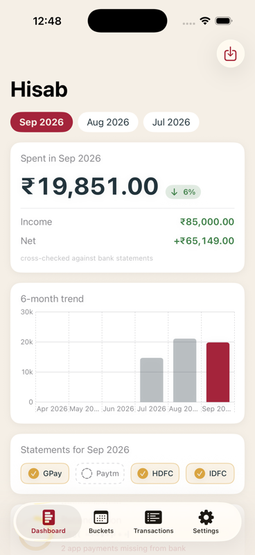
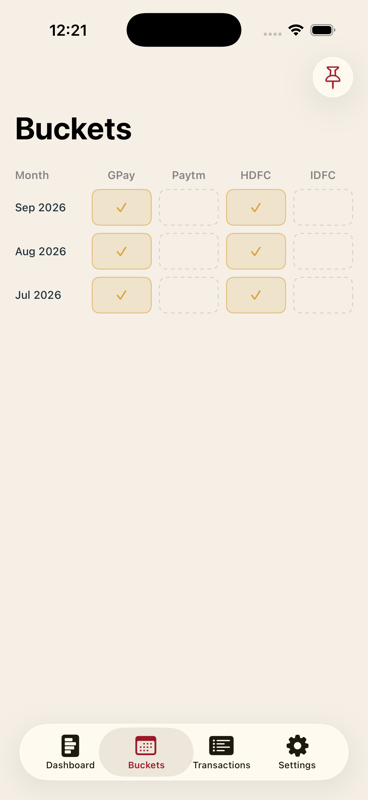
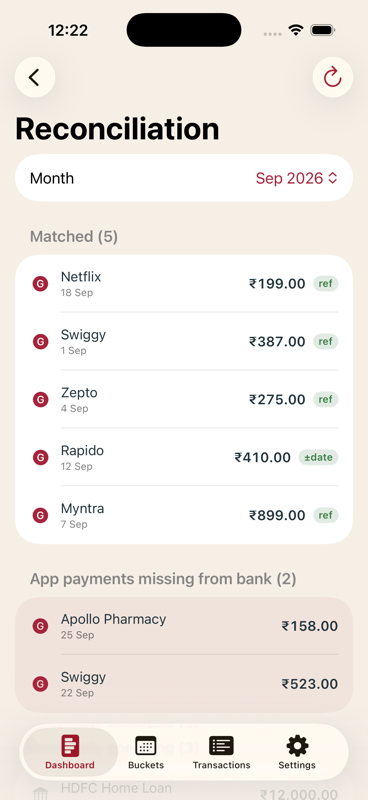
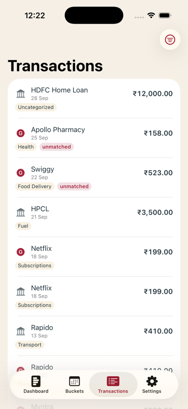

# Hisab (हिसाब)


A private, on-device iOS app for personal expense analysis. Import
Google Pay / Paytm transaction exports and HDFC / IDFC bank statements;
Hisab parses them deterministically, organizes everything into monthly
time buckets, cross-checks payment-app records against bank statements,
and shows a dashboard of where the money went.

- **On-device only** — SwiftUI + SwiftData, no server, no accounts, no
  network calls. Your financial data never leaves the phone.
- **Monthly time buckets, derived not stored** — importing any file
  auto-creates the months it covers; a yearly bank statement lights up
  all twelve months in its column. Pin future months to mark them
  "awaiting".
- **Reconciliation** — tiered matching (UPI reference first, then
  amount + date window) tells you which app payments the bank confirms,
  which are missing, and what you spent outside the apps entirely.
- **Reconciliation-nature bank data** — bank rows confirmed against an
  app payment are evidence, never duplicate records; bank-only spending
  lands as "Miscellaneous"; HDFC↔IDFC self transfers are recognized and
  excluded from spend/income entirely.
- **HisabCore** — all parsing, dedup, bucketing, reconciliation, and
  analytics logic lives in a pure-Swift package with a full XCTest
  suite that runs on macOS in milliseconds.
- **Bahi-khata design language** — palette and icon borrow from the
  traditional red-cloth Indian ledger.

## Screenshots

| Dashboard | Buckets | Reconciliation | Transactions |
|---|---|---|---|
|  |  |  |  |

## Build & run

Requirements: Xcode 26+, [xcodegen](https://github.com/yonaskolb/XcodeGen).

```sh
make gen        # xcodegen generate -> Hisab.xcodeproj
make test       # HisabCore unit tests (swift test)
make build      # build for the iPhone simulator
make run        # boot simulator, install, launch
```

Then in the app: **Settings → Load demo data** fills three months of
synthetic GPay + HDFC statements so every screen is explorable.

## Status

Feature-complete. All real-format parsers are in and validated
to-the-paisa against actual statements (each parser's debit/credit sums
match the statement's own printed totals exactly):

| Source | Formats | Notable engineering |
|---|---|---|
| Google Pay | PDF | block state machine over PDFKit text |
| Paytm | PDF + XLSX | page-order-independent amount pairing; year inference |
| IDFC FIRST | PDF + XLSX | direction recovered from the running-balance chain |
| HDFC | PDF (password-supported) | geometric table reconstruction via rect selections |

XLSX support is dependency-free (a minimal zip reader over Apple's
Compression framework plus an XMLParser sheet reader). Dual-format
imports of the same statement dedup to zero via reference-keyed,
refund-safe content hashes. Real statements live in the gitignored
`samples/`; tests use synthetic fixtures only.

Design spec: [`docs/superpowers/specs/2026-09-05-hisab-design.md`](docs/superpowers/specs/2026-09-05-hisab-design.md)
